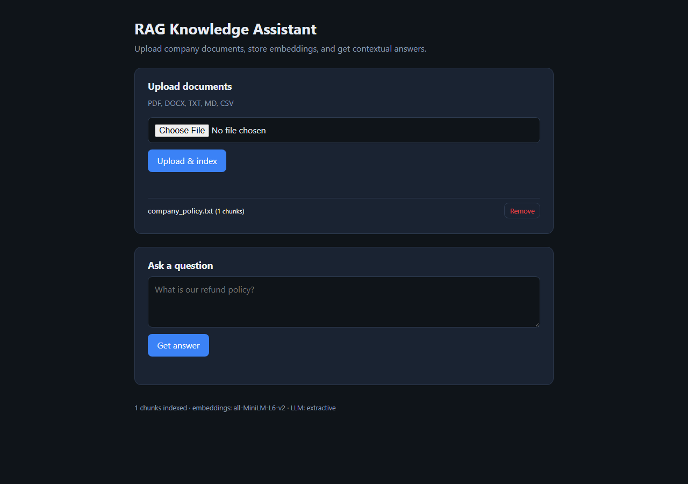
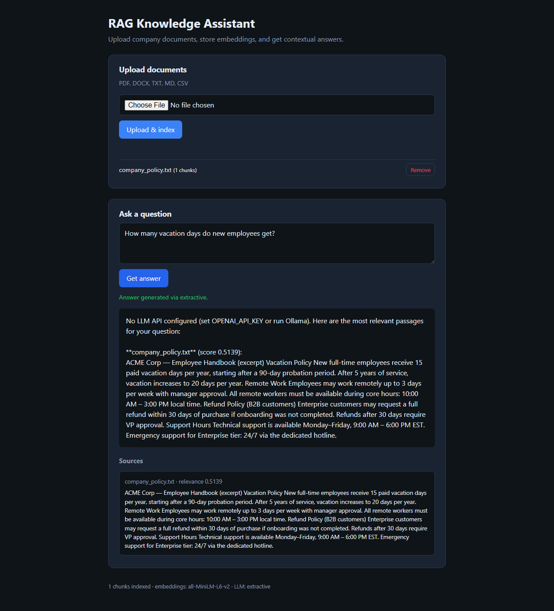
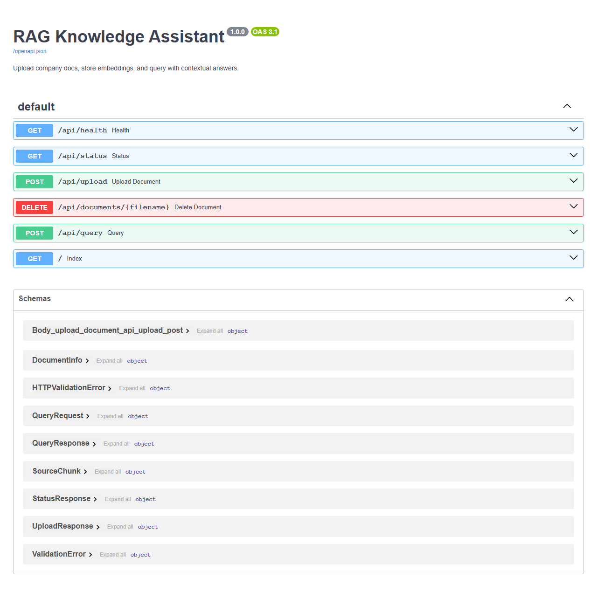

<div align="center">

# RAG Knowledge Assistant

**Turn company documents into a private, searchable knowledge base with grounded AI answers.**

Upload PDFs and office files · Store vector embeddings locally · Ask questions in plain English · Get answers cited from your sources

<br/>

[](https://www.python.org/)
[](https://fastapi.tiangolo.com/)
[](https://www.trychroma.com/)
[](LICENSE)

[Features](#-features) · [Screenshots](#-screenshots) · [Quick Start](#-quick-start) · [Configuration](#%EF%B8%8F-configuration) · [API](#-api-reference) · [Architecture](#-architecture)

</div>

---

## Overview

**RAG Knowledge Assistant** is a production-ready, local-first [Retrieval-Augmented Generation](https://en.wikipedia.org/wiki/Retrieval-augmented_generation) (RAG) application. Teams upload internal documents, the system chunks and embeds them into **ChromaDB**, and users query the knowledge base through a clean web UI or REST API. Answers are generated only from retrieved context—reducing hallucinations and keeping responses tied to your data.

| Capability | Description |
|------------|-------------|
| **Document ingestion** | PDF, DOCX, TXT, MD, CSV |
| **Semantic search** | Local embeddings via `sentence-transformers` |
| **Grounded answers** | OpenAI, Ollama, or extractive fallback |
| **Source transparency** | Every answer includes ranked source chunks |
| **Privacy-first** | Embeddings and vectors stay on your machine |

---

## Screenshots

### Dashboard — upload & manage documents

<p align="center">
  
</p>

<p align="center"><em>Upload company files, index them into the vector store, and manage your knowledge base from one screen.</em></p>

### Query — contextual answers with sources

<p align="center">
  
</p>

<p align="center"><em>Ask natural-language questions and receive answers backed by the most relevant document passages.</em></p>

### API — interactive OpenAPI docs

<p align="center">
  
</p>

<p align="center"><em>Full REST API with auto-generated Swagger UI for integrations and automation.</em></p>

---

## Features

- **Multi-format uploads** — Extract text from PDF, Word, and plain-text formats automatically  
- **Smart chunking** — Configurable chunk size and overlap for optimal retrieval  
- **Persistent vector store** — ChromaDB keeps embeddings across restarts  
- **Pluggable LLM backends** — OpenAI API, local Ollama, or passage-only extractive mode  
- **Modern web UI** — Dark-themed, responsive interface with live status  
- **Developer-friendly API** — FastAPI with typed schemas and `/docs` explorer  

---
**Request flow**

1. **Ingest** — File → text extraction → chunking → embedding → ChromaDB  
2. **Retrieve** — User question → query embedding → top-*K* similar chunks  
3. **Generate** — Retrieved context + question → LLM → answer + source list  

---

## Tech Stack

| Layer | Technology |
|-------|------------|
| API | [FastAPI](https://fastapi.tiangolo.com/) + [Uvicorn](https://www.uvicorn.org/) |
| Vector DB | [ChromaDB](https://www.trychroma.com/) |
| Embeddings | [sentence-transformers](https://www.sbert.net/) (`all-MiniLM-L6-v2`) |
| LLM | OpenAI API · [Ollama](https://ollama.com/) · extractive fallback |
| Parsing | [PyPDF](https://pypi.org/project/pypdf/) · [python-docx](https://python-docx.readthedocs.io/) |
| Frontend | Vanilla HTML / CSS / JavaScript |

---

## Quick Start

### Prerequisites

- **Python 3.11+**
- **8 GB RAM** recommended (embedding model + dependencies)
- *(Optional)* [Ollama](https://ollama.com/) or an **OpenAI API key** for synthesized answers

### Installation

```bash
# Clone the repository
git clone https://github.com/YOUR_USERNAME/RagBased.git
cd RagBased

# Create and activate a virtual environment
python -m venv .venv

# Windows
.venv\Scripts\activate

# macOS / Linux
source .venv/bin/activate

# Install dependencies
pip install -r requirements.txt

# Optional: configure environment
cp .env.example .env   # Linux/macOS
copy .env.example .env # Windows
```

### Run

```powershell
# Windows (recommended)
.\run.ps1
```

```bash
# Or manually
uvicorn app.main:app --reload --host 127.0.0.1 --port 8765
```

Open **[http://127.0.0.1:8765](http://127.0.0.1:8765)** in your browser.

> **Port note:** If `8000` or `8080` are in use on your machine, the default `8765` avoids conflicts.

### Try the sample document

1. Start the server  
2. Upload `sample_docs/company_policy.txt`  
3. Ask: *"How many vacation days do new employees get?"*  
4. Review the answer and cited sources  

---

## Configuration

Copy `.env.example` to `.env` and adjust as needed:

| Variable | Default | Description |
|----------|---------|-------------|
| `OPENAI_API_KEY` | — | Enables OpenAI answer generation |
| `OPENAI_MODEL` | `gpt-4o-mini` | Chat model name |
| `OLLAMA_BASE_URL` | `http://localhost:11434` | Local Ollama endpoint |
| `OLLAMA_MODEL` | `llama3.2` | Ollama model tag |
| `EMBEDDING_MODEL` | `all-MiniLM-L6-v2` | Sentence-transformers model |
| `CHUNK_SIZE` | `800` | Characters per chunk |
| `CHUNK_OVERLAP` | `150` | Overlap between chunks |
| `TOP_K` | `5` | Chunks retrieved per query |

**LLM priority:** OpenAI (if key set) → Ollama (if model available) → extractive passages

---

## API Reference

| Endpoint | Method | Description |
|----------|--------|-------------|
| `/api/upload` | `POST` | Upload & index a document (`multipart/form-data`, field `file`) |
| `/api/query` | `POST` | `{"question": "..."}` → answer + sources |
| `/api/status` | `GET` | Indexed documents and system metadata |
| `/api/documents/{filename}` | `DELETE` | Remove a document from the index |
| `/api/health` | `GET` | Health check |

**Example — query**

```bash
curl -X POST http://127.0.0.1:8765/api/query \
  -H "Content-Type: application/json" \
  -d "{\"question\": \"What is the remote work policy?\"}"
```

**Interactive docs:** [http://127.0.0.1:8765/docs](http://127.0.0.1:8765/docs)

---

## Project Structure

```
RagBased/
├── app/
│   ├── main.py                 # FastAPI routes & app entry
│   ├── config.py               # Environment settings
│   ├── models/schemas.py       # Pydantic request/response models
│   └── services/
│       ├── document_processor.py
│       ├── embeddings.py
│       ├── vector_store.py
│       └── rag_chain.py
├── static/                     # Web UI (HTML, CSS, JS)
├── sample_docs/                # Example company policy
├── docs/screenshots/           # README screenshots
├── scripts/
│   ├── capture_screenshots.py
│   └── smoke_test.py
├── requirements.txt
├── run.ps1
└── .env.example
```

Runtime data is stored under `data/` (uploads + ChromaDB) and is git-ignored.

---

## Regenerating Screenshots

For maintainers updating the README visuals:

```bash
pip install playwright
playwright install chromium

# With the server running on port 8765
python scripts/capture_screenshots.py
```

Outputs are written to `docs/screenshots/`.

---

## Roadmap

- [ ] Authentication & multi-tenant collections  
- [ ] Batch folder upload  
- [ ] Conversation history  
- [ ] Docker Compose deployment  
- [ ] Additional embedding models  

---

## Contributing

Contributions are welcome. Please open an issue to discuss significant changes before submitting a pull request.

1. Fork the repository  
2. Create a feature branch (`git checkout -b feature/amazing-feature`)  
3. Commit your changes (`git commit -m 'Add amazing feature'`)  
4. Push to the branch (`git push origin feature/amazing-feature`)  
5. Open a Pull Request  

---

## License

This project is licensed under the **MIT License** — see the [LICENSE](LICENSE) file for details.

---

<div align="center">

**Built for teams who need answers from their own documents—not the public internet.**

If this project helps you, consider giving it a star on GitHub.

</div>
